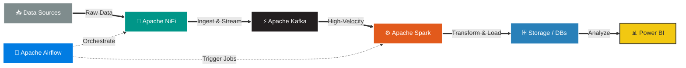

<!-- ════════════════════════════════════════════════════════════════ -->
<!--                        HEADER BANNER                             -->
<!-- ════════════════════════════════════════════════════════════════ -->

  

<!-- DYNAMIC TYPING ANIMATION (Data + Business + AI Connection) -->

  

<!-- BADGES & VISITS -->

  
  

---

<!-- ════════════════════════════════════════════════════════════════ -->
<!--                          ABOUT ME                                -->
<!-- ════════════════════════════════════════════════════════════════ -->

### 🎓 Education & Background
*   **B.Sc. in Computers and Artificial Intelligence** – Capital University (formerly Helwan University)
*   **Big Data Training Track** – Samsung Innovation Campus
*   **NextStep Mentorship Program** – UNICEF Mentees (Supported by Deloitte)

---

### 🛠️ Technical Toolbox

#### 🌌 Data Engineering & Big Data Ecosystem

##### ⚡ Dynamic Data Pipeline Workflow

#### 🗄️ Databases & Storage (SQL & NoSQL)

#### 💻 Programming Languages & Backend Frameworks

#### ⚙️ DevOps & Tools

---

## 📊 GitHub Analytics

---

## 🤝 Let's Connect

